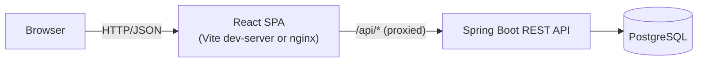
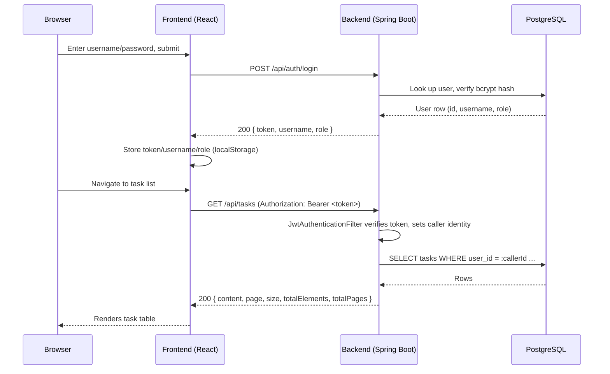
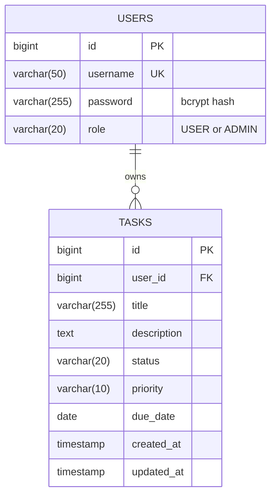

# Task Manager

A full-stack task management application built as an incremental, phase-by-phase
learning project. It pairs a **Spring Boot 4 REST API** (Java 21, PostgreSQL,
Spring Security + JWT) with a **React 19 + TypeScript** frontend (Vite, MUI,
React Hook Form), and ships with a real automated test suite and a Docker
Compose deployment.

Every user has their own private, authenticated task list. An `ADMIN` role can
additionally view (read-only) every user's tasks and every registered account
through a dedicated `/admin` area.

> **Project status:** all 20 phases of the original learning roadmap are
> complete (see [Project History](#project-history-how-this-was-built) below).

---

## Table of contents

- [What this app does](#what-this-app-does)
- [Tech stack](#tech-stack)
- [Architecture](#architecture)
- [Project structure](#project-structure)
- [Getting started](#getting-started)
  - [Option A — run natively (recommended for development)](#option-a--run-natively-recommended-for-development)
  - [Option B — run everything in Docker](#option-b--run-everything-in-docker)
- [Demo accounts](#demo-accounts)
- [Using the application](#using-the-application)
- [API reference](#api-reference)
- [Authentication & authorization model](#authentication--authorization-model)
- [Database schema](#database-schema)
- [Testing](#testing)
- [Configuration reference](#configuration-reference)
- [Design decisions worth knowing](#design-decisions-worth-knowing)
- [Known limitations / what's not here](#known-limitations--whats-not-here)
- [Troubleshooting](#troubleshooting)
- [Project history (how this was built)](#project-history-how-this-was-built)

---

## What this app does

From an end user's perspective, this is a task manager:

- Register an account (or log in as one of the two seeded demo users)
- Create, view, edit, and delete tasks
- Mark a task's status (`TODO` → `IN_PROGRESS` → `DONE` / `CANCELLED`)
- Search tasks by title/description text
- Filter by status
- Sort by title, status, priority, or due date
- Paginate through results

Every task belongs to exactly one user — there is no sharing or collaboration
between regular accounts. A separate `ADMIN` role (granted only via a
database seed, not through the UI) can additionally browse every user's tasks
and the full user list, for oversight purposes only — an admin cannot edit or
delete another user's data.

## Tech stack

### Backend

| Concern | Choice |
|---|---|
| Language / runtime | Java 21 |
| Framework | Spring Boot 4.1 (Spring MVC, `spring-boot-starter-webmvc`) |
| Persistence | Spring Data JPA / Hibernate 7 + PostgreSQL 17 |
| Migrations | Flyway |
| Auth | Spring Security 7.1 + JJWT 0.12.6 (JWT, HMAC-signed, stateless sessions) |
| Validation | Jakarta Bean Validation |
| Build | Maven (wrapper committed — no local Maven install needed) |
| Boilerplate reduction | Lombok (entities only) |

### Frontend

| Concern | Choice |
|---|---|
| Framework | React 19.2 + TypeScript ~6.0 |
| Build tool | Vite 8 |
| UI library | Material UI (MUI) 9.3 |
| Routing | React Router 7 |
| HTTP client | Axios |
| Forms | React Hook Form + Yup schema validation |
| Testing | Vitest + React Testing Library + `@testing-library/user-event` |
| Linting | oxlint |

### Infrastructure

- **PostgreSQL 17** — the only stateful piece
- **Docker / Docker Compose** — full containerized deployment (backend, frontend + nginx, postgres)
- **nginx** — serves the built frontend and reverse-proxies API calls to the backend in the containerized deployment

No state-management library (Redux/Zustand/React Query) is used — a custom
hook (`useTasks`) plus React Context (`AuthContext`) is enough at this app's
scale; see [Design decisions worth knowing](#design-decisions-worth-knowing).

## Architecture

Two independently deployable applications talking over HTTP/JSON, sitting in
front of one PostgreSQL database:



In **local dev**, the Vite dev server proxies `/api/*` to the backend on
`localhost:8080` (`frontend/vite.config.ts`). In the **Docker deployment**,
nginx plays the same role (`frontend/nginx.conf`) — same shape, different
process serving it. Either way, the browser only ever talks to one origin, so
**no CORS configuration exists anywhere in the backend** — it's simply never
needed.

The backend itself is strictly layered:

```text
Controller → Service → Repository → Entity
```

- **Controllers** handle HTTP concerns only (status codes, request/response
  DTOs) — they never see JPA entities.
- **Services** hold business logic, are HTTP-agnostic, and enforce
  per-user data ownership.
- **Repositories** are Spring Data JPA interfaces — persistence only.
- Packages are organized **by feature** (`task/`, `user/`, `security/`,
  `admin/`), not by layer — everything about one feature lives together.

The frontend mirrors this with a thin API layer: pages compose presentational
components, a custom hook (`useTasks`) owns all list-fetching/search/filter/
sort/paginate state, and `src/api/` isolates every Axios call behind a typed
function — no component calls Axios directly.

### Request flow: logging in and fetching tasks



## Project structure

```text
learning-task-manager/
├── docker-compose.yml         Full containerized stack (postgres + backend + frontend)
├── CLAUDE.md                  Extremely detailed build log / project memory (see note below)
├── backend/                   Spring Boot REST API
│   ├── Dockerfile              Multi-stage build → runnable jar image
│   ├── docker-compose.yml      Local Postgres ONLY, for native (non-Docker) backend dev
│   ├── pom.xml
│   ├── mvnw / mvnw.cmd / .mvn/ Maven wrapper (no local Maven install required)
│   └── src/
│       ├── main/java/com/learning/taskmanager/
│       │   ├── TaskManagerApplication.java
│       │   ├── common/exception/    ApiExceptionHandler, ErrorResponse, domain exceptions
│       │   ├── user/                User entity, Role enum, UserRepository
│       │   ├── security/            JWT filter/service, SecurityConfig, AuthController,
│       │   │                        AppUserPrincipal, entry point / access-denied handlers
│       │   ├── task/                Task entity, TaskController/Service/Repository, DTOs
│       │   └── admin/               Read-only cross-user admin endpoints
│       ├── main/resources/
│       │   ├── application.yml
│       │   └── db/migration/        Flyway migrations, V1–V5
│       └── test/java/...            Unit, slice, and full-integration tests (see Testing)
└── frontend/                   Vite + React + TypeScript SPA
    ├── Dockerfile               Multi-stage build → nginx-served static bundle
    ├── nginx.conf               Reverse-proxies /api, SPA fallback to index.html
    ├── vite.config.ts           Dev-server proxy + Vitest config
    ├── package.json
    └── src/
        ├── main.tsx / App.tsx   Routing, providers, theme
        ├── types/               Shared TypeScript types (mirror backend DTOs)
        ├── contexts/            AuthContext (login/register/logout, current user/role)
        ├── api/                 Typed Axios calls — the only place Axios is imported
        ├── hooks/                useTasks — all task-list state (search/filter/sort/page)
        ├── components/          Presentational components + route guards
        └── pages/               Routed screens (login, register, task list, task form, admin)
```

> **About `CLAUDE.md`**: this repository was built with an AI pair-programming
> assistant (Claude Code), one phase at a time. `CLAUDE.md` is the running
> memory/design-log from that process — it records *every* decision made
> along the way (including alternatives considered and rejected) in far more
> detail than a normal README would. This `README.md` is the human-facing
> summary; `CLAUDE.md` is the exhaustive "why" behind it, useful if you want
> to understand a specific decision in depth.

## Getting started

### Prerequisites

- **Java 21** (JDK)
- **Node.js ≥ 20.19 or ≥ 22.12** — this is a hard requirement, not just a
  recommendation; see [Troubleshooting](#troubleshooting)
- **Docker Desktop** (or another Docker Compose-compatible runtime)
- **Git**

Maven does **not** need to be installed — the committed wrapper (`./mvnw`)
handles it.

### Option A — run natively (recommended for development)

This runs Postgres in Docker but the backend/frontend directly on your
machine — the fastest inner loop for active development (hot reload on both
sides).

**1. Start PostgreSQL**

```bash
cd backend
docker compose up -d
```

Starts Postgres 17 on `localhost:5433` (database/user/password all
`taskmanager` — deliberately a non-default port to avoid colliding with any
other local Postgres instance).

**2. Run the backend**

```bash
cd backend
./mvnw spring-boot:run          # macOS/Linux
.\mvnw.cmd spring-boot:run       # Windows PowerShell
```

The API starts at **http://localhost:8080**. Flyway applies all database
migrations automatically on startup — no manual schema step needed.

**3. Run the frontend**

In a second terminal:

```bash
cd frontend
npm install
npm run dev
```

The app opens at **http://localhost:5173**. Vite's dev-server proxy forwards
`/api/*` to the backend, so the browser only ever talks to one origin.

**4. Open the app**

Go to http://localhost:5173 — you'll land on the login page. Use one of the
[demo accounts](#demo-accounts), or register a new one.

### Option B — run everything in Docker

This builds and runs the whole stack — Postgres, backend, and an nginx-served
frontend build — in containers. Nothing needs to be installed locally except
Docker itself.

```bash
docker compose up --build
```

(Run from the repository root — this is a different, separate
`docker-compose.yml` from the one in `backend/`, see
[Project structure](#project-structure).)

This starts:

| Service | URL | Notes |
|---|---|---|
| Frontend | http://localhost:8081 | nginx, serves the app and proxies `/api` |
| Backend | http://localhost:8080 | direct API access, e.g. for `curl`/Postman |
| Postgres | *(not exposed to host)* | only reachable from the `backend` container |

Stop everything with:

```bash
docker compose down
```

Add `-v` to also delete the Postgres data volume (`docker compose down -v`).

**Overriding secrets for a real deployment.** Two values default to
committed, non-secret placeholders and should be overridden via environment
variables before this compose file is used anywhere beyond local
exploration:

```bash
JWT_SECRET="a-long-random-string-at-least-32-bytes" \
POSTGRES_PASSWORD="a-real-password" \
docker compose up --build
```

## Demo accounts

Two accounts are seeded automatically by Flyway migration `V4`/`V5` (both
work identically whether you're running natively or via Docker, since
migrations run against whichever Postgres the backend connects to):

| Username | Password | Role |
|---|---|---|
| `alice` | `password123` | `ADMIN` |
| `bob` | `password123` | `USER` |

You can also self-register a new account from the login page — new accounts
always get the `USER` role (there is currently no in-app way to promote a
user to `ADMIN`; it's only done via the seed migration).

## Using the application

1. **Register or log in.** `/register` creates an account and logs you in
   immediately; `/login` is for an existing account (including the demo
   accounts above).
2. **Task list (`/`).** Search by text, filter by status, click a column
   header to sort, and use the pagination controls at the bottom of the
   table.
3. **Create a task** via the "New Task" button (`/tasks/new`) — title is
   required, everything else (description, priority, due date) is optional
   or defaulted.
4. **Edit a task** via its row's "Edit" link — the same form, pre-filled.
5. **Delete a task** via its row's "Delete" link — asks for confirmation
   first.
6. **Log out** via the button in the top bar — this clears your session
   token and returns you to the login page.
7. **Admin view (`/admin`, admin accounts only).** If you're logged in as
   an `ADMIN` (e.g. `alice`), an "Admin" link appears in the top bar. It
   shows every registered user (with their role) and every task in the
   system (with its owner) — read-only, no edit/delete actions here.

## API reference

All endpoints are JSON over HTTP. Authenticated endpoints require an
`Authorization: Bearer <token>` header, obtained from `/api/auth/login` or
`/api/auth/register`.

### Auth — `/api/auth` (public, no token required)

| Method | Endpoint | Body | Response |
|---|---|---|---|
| `POST` | `/api/auth/login` | `{ "username", "password" }` | `200 { token, username, role }` / `401` on bad credentials |
| `POST` | `/api/auth/register` | `{ "username", "password" }` | `201 { token, username, role }` (auto-login) / `409` if username taken / `400` on invalid input |

`username`: max 50 characters. `password`: minimum 6 characters (enforced
only on register — login rejects blank but doesn't leak the length policy).

### Tasks — `/api/tasks` (requires authentication, scoped to the caller)

| Method | Endpoint | Description |
|---|---|---|
| `GET` | `/api/tasks` | List the caller's tasks — see query params below |
| `GET` | `/api/tasks/{id}` | Get one task (404 if it doesn't exist *or* belongs to someone else) |
| `POST` | `/api/tasks` | Create a task — `201` |
| `PUT` | `/api/tasks/{id}` | Full update — `200` |
| `PATCH` | `/api/tasks/{id}/status` | Update only the status — `200` |
| `DELETE` | `/api/tasks/{id}` | Delete — `204` |

**Query parameters for `GET /api/tasks`:**

| Param | Type | Notes |
|---|---|---|
| `search` | string | matches title or description, case-insensitive |
| `status` | `TODO` \| `IN_PROGRESS` \| `DONE` \| `CANCELLED` | exact match |
| `page` | integer | zero-based, default `0` |
| `size` | integer | default `20` |
| `sort` | string | Spring `Pageable` sort, e.g. `dueDate,asc` |

Example:

```
GET /api/tasks?search=report&status=TODO&page=0&size=10&sort=dueDate,asc
```

**Request body** (`POST` / `PUT`):

```json
{
  "title": "Finish the README",
  "description": "Cover setup, API, and testing",
  "status": "TODO",
  "priority": "HIGH",
  "dueDate": "2026-09-20"
}
```

- `title`: required, non-blank
- `status`: required, one of `TODO` / `IN_PROGRESS` / `DONE` / `CANCELLED`
- `priority`: required, one of `LOW` / `MEDIUM` / `HIGH`
- `description`, `dueDate`: optional

**List response shape** (`GET /api/tasks`):

```json
{
  "content": [ /* array of tasks */ ],
  "page": 0,
  "size": 20,
  "totalElements": 3,
  "totalPages": 1
}
```

### Admin — `/api/admin` (requires the `ADMIN` role, else `403`)

| Method | Endpoint | Description |
|---|---|---|
| `GET` | `/api/admin/tasks` | Every user's tasks, paginated (`page`/`size`), each including `ownerUsername` |
| `GET` | `/api/admin/users` | Every registered user: `{ id, username, role }` (not paginated) |

### Error shape

Every error response (validation failure, not-found, auth failure, etc.)
shares one consistent shape:

```json
{
  "timestamp": "2026-09-20T10:15:30",
  "status": 400,
  "error": "Bad Request",
  "message": "Validation failed",
  "path": "/api/tasks",
  "fieldErrors": [
    { "field": "title", "message": "must not be blank" }
  ]
}
```

`fieldErrors` is only present for validation failures. Status codes used
throughout: `400` (validation), `401` (missing/invalid token, bad login),
`403` (authenticated but not authorized — admin-only endpoints), `404`
(resource not found, including another user's resource), `409` (duplicate
username).

## Authentication & authorization model

- **Stateless JWT auth.** Login/register issue an HMAC-signed JWT (no
  server-side session). Every subsequent request carries it as
  `Authorization: Bearer <token>`; a filter (`JwtAuthenticationFilter`)
  verifies it and resolves the caller's identity on each request. Tokens
  expire after 1 hour (`app.jwt.expiration-ms`) — no refresh-token flow
  exists yet, so an expired token simply requires logging in again.
- **Per-user ownership, not shared data.** Every task has a `user_id`. Every
  service/repository method is scoped to the caller's id — there is no
  endpoint that returns another user's tasks (except the dedicated admin
  endpoints below).
- **404, not 403, for another user's resource.** Trying to access another
  user's task by ID returns "not found," not "forbidden" — this avoids
  confirming to a caller that a given ID exists at all, which is the
  standard practice for this kind of ownership check.
- **Role-based admin access is a separate, additive layer.** `ADMIN` is not
  "can do anything" — it only unlocks the read-only `/api/admin/**`
  endpoints. An admin's own tasks still go through the normal per-user
  `/api/tasks` endpoints like anyone else's. A non-admin hitting an admin
  endpoint gets a real `403` (unlike the 404-for-ownership case above,
  since "you're not an admin" doesn't leak anything about specific data).
- **Password hashing.** BCrypt, via Spring Security's `PasswordEncoder`.
  Plaintext passwords are never stored or logged.
- **Token storage (frontend).** `localStorage`, attached to every outgoing
  request via an Axios interceptor. A global response interceptor reacts to
  any `401` (other than from the login/register calls themselves) by
  clearing the token and redirecting to `/login`.

## Database schema

Two tables, connected by a foreign key:



Schema is owned entirely by Flyway migrations (`backend/src/main/resources/db/migration`) —
Hibernate's `ddl-auto` is set to `validate` only, never used to change the
schema.

| Migration | Adds |
|---|---|
| `V1__create_tasks_table.sql` | `tasks` table |
| `V2__create_users_table.sql` | `users` table |
| `V3__add_user_id_to_tasks.sql` | `tasks.user_id` FK |
| `V4__seed_demo_users.sql` | seeds `alice`/`bob` |
| `V5__add_role_to_users.sql` | `users.role`, promotes `alice` to `ADMIN` |

`status`/`priority`/`role` are plain `VARCHAR` (mapped via Java
`@Enumerated(EnumType.STRING)`), not native Postgres enum types — much
easier to evolve via a migration than `ALTER TYPE ... ADD VALUE`.

## Testing

Both apps have a real, permanent, automated test suite — not scaffolding.

### Backend — `cd backend && ./mvnw test`

Three tiers, each testing at the layer that actually needs it:

| Layer | Class(es) | What it proves |
|---|---|---|
| Unit | `TaskServiceTest` | Business logic, with `TaskRepository` mocked (Mockito) — no Spring context |
| Repository slice | `TaskRepositoryTest` | The custom search query, against a **real** Postgres (`@DataJpaTest`) |
| Web slice | `TaskControllerTest`, `AdminControllerTest` | HTTP status codes, response shapes, security wiring — service mocked |
| Full integration | `SecurityIntegrationTest` | Real login/register/JWT/role checks through the actual Spring Security filter chain, against real Postgres |

**43 tests total.** Requires the local Postgres container running
(`cd backend && docker compose up -d`) since the repository/integration
tiers hit a real database.

### Frontend — `cd frontend && npm test`

Vitest + React Testing Library, mocking the API layer (no real backend
needed):

| Area | File | What it covers |
|---|---|---|
| List state | `hooks/useTasks.test.ts` | Search debounce, sort/filter/pagination resets, delete-then-refetch, a stale-response race condition |
| Auth state | `contexts/AuthContext.test.tsx` | Login/register/logout, `localStorage` persistence, admin-role derivation |
| Forms | `components/TaskForm.test.tsx`, `pages/LoginPage.test.tsx`, `pages/RegisterPage.test.tsx` | Validation errors, real submission flow |
| Route guards | `components/ProtectedRoute.test.tsx`, `components/AdminRoute.test.tsx` | Redirect behavior for unauthenticated / non-admin users |
| Presentational | `components/TaskTable.test.tsx`, `components/StatusBadge.test.tsx` | Rendering, sort clicks, the delete-confirm gate |

**43 tests total.** Requires Node ≥ 20.19/22.12 (see
[Troubleshooting](#troubleshooting)) — no backend or database needed, every
API call is mocked.

## Configuration reference

### Backend (`backend/src/main/resources/application.yml`)

| Property | Default (local dev) | Overridable via |
|---|---|---|
| `spring.datasource.url` | `jdbc:postgresql://localhost:5433/taskmanager` | `SPRING_DATASOURCE_URL` |
| `spring.datasource.username` / `.password` | `taskmanager` / `taskmanager` | `SPRING_DATASOURCE_USERNAME` / `_PASSWORD` |
| `app.jwt.secret` | a committed dev-only placeholder | `APP_JWT_SECRET` |
| `app.jwt.expiration-ms` | `3600000` (1 hour) | — |

Any Spring property can be overridden by an environment variable using
Spring's relaxed-binding naming (uppercase, `.` → `_`) — this is how
`docker-compose.yml` points the containerized backend at the containerized
Postgres without touching `application.yml` at all.

**⚠️ Never reuse the committed `app.jwt.secret` default for a real
deployment.** It's fine for local, offline development only.

### Frontend (`frontend/vite.config.ts`)

| Setting | Value | Purpose |
|---|---|---|
| `server.proxy['/api']` | `http://localhost:8080` | Dev-server proxy to the backend (avoids CORS) |
| `test.environment` | `jsdom` | Vitest's DOM environment |

The frontend has no build-time API URL configuration — `api/client.ts`
always uses the relative path `/api`, which works unchanged whether it's
proxied by Vite (dev) or by nginx (Docker).

## Design decisions worth knowing

A few choices that come up naturally if you're explaining this project to
someone else:

- **Why per-user ownership instead of a shared list?** The app originally
  had one shared task list for every caller. Once login was added, keeping
  tasks genuinely private per account was the more realistic, useful
  behavior for a "task manager" — a deliberate, explicit revision, not an
  oversight.
- **Why JWT in `localStorage` instead of an httpOnly cookie?** Simpler for
  this app's threat model (no CSRF story needed since there's no cookie),
  at the cost of the token being readable by any script on the page — a
  reasonable tradeoff for a learning app, worth revisiting for anything
  handling sensitive real-world data.
- **Why 404 instead of 403 for another user's task, but a real 403 for
  non-admins on `/api/admin/**`?** The first case is about not confirming a
  specific resource's existence to someone who has no right to see it. The
  second case reveals nothing resource-specific — "you're not an admin" is
  safe to say plainly.
- **Why does the JWT not carry the user's role?** Only the username is in
  the token; the role is looked up fresh from the database on every
  request. This means a role change takes effect on the user's very next
  login, with no token-revocation mechanism needed.
- **Why a URL-matcher (`hasRole("ADMIN")`) instead of `@PreAuthorize`
  everywhere?** This app has exactly one admin-gated area, cleanly
  identified by one URL prefix (`/api/admin/**`) — method-level security
  would be the right tool once authorization rules stop lining up cleanly
  with URL prefixes.
- **Why does the same relative `/api` base URL work in both dev and Docker?**
  Because both environments put a reverse proxy (Vite's dev server, or
  nginx) in front of the backend on the *same origin* as the frontend — the
  browser never makes a cross-origin request, so no CORS configuration
  exists anywhere in this app.

(`CLAUDE.md` has the full, much longer version of this reasoning for
essentially every decision made across all 20 phases, including dead ends
and bugs hit along the way — worth reading if you want the complete story
behind a specific choice.)

## Known limitations / what's not here

Being upfront about scope — none of these are oversights, they're
deliberate boundaries for a learning project:

- No way to promote/demote a user's role, or for an admin to edit/delete
  another user's task, through the app itself (`ADMIN` is granted only via
  a migration).
- No token refresh — a JWT is valid for exactly 1 hour, then it's a normal
  re-login.
- No rate-limiting on login/registration, no password reset / email
  verification.
- No per-field mapping of backend validation errors onto specific form
  fields (a generic error message is shown instead) — acceptable since the
  frontend's Yup schemas already mirror every backend constraint.
- No CI/CD pipeline, no HTTPS/TLS termination in the Docker setup, no
  container orchestration beyond a single-host `docker compose up`, no
  image registry/versioning.
- No end-to-end (Playwright/Cypress-style) browser test suite — the
  automated tests are unit/component-level; cross-cutting integration is
  verified manually in a real browser against the real backend.

## Troubleshooting

**`npm test` (or `npm run dev`/`build`) fails with `ERR_REQUIRE_ESM` or
similar.** This project's toolchain (Vite 8 / Vitest 4) requires **Node ≥
20.19 or ≥ 22.12**. A Node version just below that (e.g. `20.17.x`) will
often install fine and even run `npm run build` with only a warning, but
will hard-crash running the test suite specifically (a transitive `jsdom`
dependency needs the newer Node). Check your Node version:

```bash
node --version
```

and switch to a qualifying version (e.g. via `nvm`) if it's older.

**Backend fails to start with a `WeakKeyException` mentioning JWT/HMAC
keys.** `app.jwt.secret` (or `APP_JWT_SECRET`) must be at least 32
characters/bytes — HMAC-SHA requires a key of at least 256 bits, and the
app uses the string's raw bytes directly with no hashing/stretching. Use a
longer secret.

**`docker compose up` (from the repo root) fails to bind port 8080 or
8081.** Something else is already listening there — most likely a natively
running backend (`./mvnw spring-boot:run`) or a previous `docker compose`
session that wasn't stopped. Stop it first, or change the host-side port
in `docker-compose.yml`.

**Backend can't connect to Postgres (`Connection refused`) when running
natively.** Make sure `cd backend && docker compose up -d` was run first,
and that nothing else is bound to port `5433`.

**`mvn test` / `./mvnw test` fails on the repository/integration tests.**
These need a real Postgres running — see the previous point.

## Project history (how this was built)

This app was built incrementally as a guided learning project, one phase at
a time, each explained and verified before moving to the next:

| # | Phase | # | Phase |
|---|---|---|---|
| 1 | Architecture & requirements | 11 | React project initialization |
| 2 | Spring Boot backend initialization | 12 | React routing & layout |
| 3 | Database configuration | 13 | Task list UI |
| 4 | Task entity & migration | 14 | Create/update task form |
| 5 | Repository layer | 15 | Search, filtering & pagination |
| 6 | DTOs & validation | 16 | Frontend API integration |
| 7 | Service layer | 17 | Authentication (Spring Security + JWT) |
| 8 | REST controller | 18 | Role-based authorization |
| 9 | Exception handling | 19 | Automated testing (frontend) |
| 10 | Backend testing | 20 | Docker & deployment |

The full, detailed account of *why* each decision was made — including
alternatives considered, bugs hit and fixed, and every gotcha encountered
along the way — lives in [`CLAUDE.md`](./CLAUDE.md).
